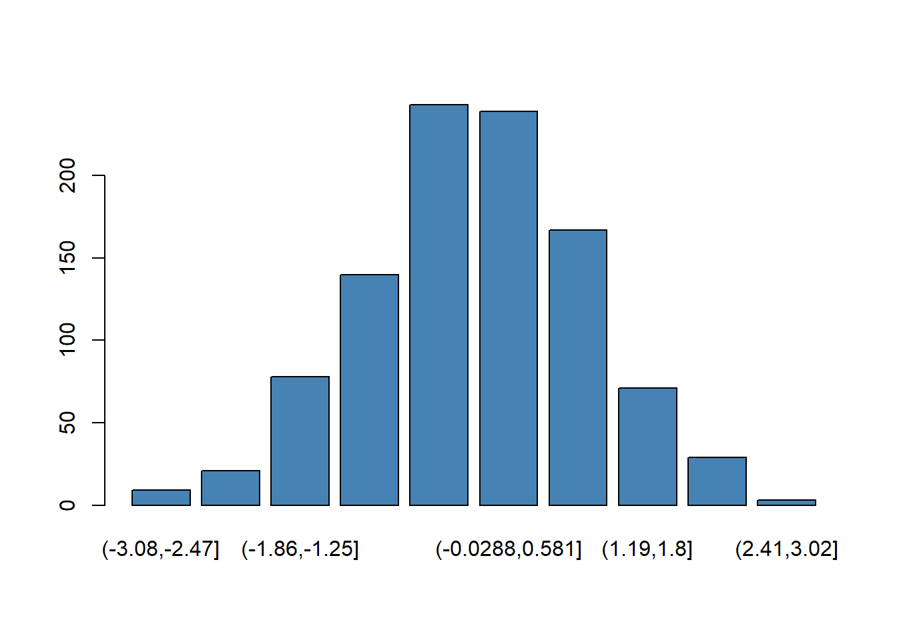

<br><br><br>


::: {.cell}
::: {.cell-output .cell-output-stdout}
```
::: {.div1} 

VARNAME

::: 
```
:::

::: {.cell-output .cell-output-stdout}
```
::: {.div2} 

**LABEL**: Ipsum is simply dummy text of the printing and typesetting industry.

::: 
```
:::

::: {.cell-output .cell-output-stdout}
```
::: {.div3} 

**DATA TYPE**: numeric

**SCOPE**: PZ

::: 
```
:::

::: {.cell-output .cell-output-stdout}
```
::: {.div4} 

**DESCRIPTION**: Lorem Ipsum is simply dummy text of the printing and typesetting industry. Lorem Ipsum has been the industry's standard dummy text ever since the 1500s, when an unknown printer took a galley of type and scrambled it to make a type specimen book.

##### LEVELS

|FLEVEL |LABEL      | 
|:------|:----------| 
|AL     |Alabama    | 
|AK     |Alaska     | 
|AZ     |Arizona    | 
|AR     |Arkansas   | 
|CA     |California | 
|CO     |Colorado   | 


**LOCATION CODE**: SCHED-A-PART-01-LINE-01

::: 
```
:::

::: {.cell-output .cell-output-stdout}
```
::: {.div5} 

##### Properties

|p1           |p2    | 
|:------------|:-----| 
|Distinct (n) |49156 | 
|Distinct (%) |3.7   | 
|Missing (n)  |934   | 
|Missing (%)  |0.3   | 


::: 
```
:::

::: {.cell-output .cell-output-stdout}
```
::: {.div6} 

##### Quantiles

|q1   |   q2| 
|:----|----:| 
|Q-05 |    0| 
|Q-25 |  100| 
|Q-50 |  500| 
|Q-75 |  900| 
|Q-95 | 1234| 


::: 
```
:::

::: {.cell-output .cell-output-stdout}
```
::: {.div7} 

##### Statistics

|s1       |s2 | 
|:--------|:--| 
|Min      |x  | 
|Median   |x  | 
|Mean     |x  | 
|Max      |x  | 
|Skew     |x  | 
|Kurtosis |x  | 


::: 
```
:::

::: {.cell-output .cell-output-stdout}
```
::: {.div8} 
```
:::

::: {.cell-output-display}
{width=672}
:::

::: {.cell-output .cell-output-stdout}
```
::: 
```
:::

::: {.cell-output .cell-output-stdout}
```
::: {.div9} 

##### Example values

|     V1|     V2|     V3|     V4|     V5| 
|------:|------:|------:|------:|------:| 
|  71843|  -2949| 176240| 120953|  61019| 
|  55397| 199947|  69547|  89154| 227532| 
| 105947| 195714|  68329|  60186|  75175| 
| 115339|  99870| 121507| -61817| 123583| 
| 257411|  41525|  98819|   1666| -15811| 


::: 
```
:::
:::


<br>
<hr>
<br>





```{.r .cell-code}
# results="asis"
create_section( x1=vname, x2=vlabel, x3=vtype, x4=vscope, 
                x5=desc, x6=k, x7=loc, x8=p, x9=q, x10=s )
```

::::: {.parent} 

::: {.div1} 

VARNAME

::: 

::: {.div2} 

**LABEL**: Ipsum is simply dummy text of the printing and typesetting industry.

::: 

::: {.div3} 

**DATA TYPE**: numeric

**SCOPE**: PZ

::: 

::: {.div4} 

**DESCRIPTION**: Lorem Ipsum is simply dummy text of the printing and typesetting industry. Lorem Ipsum has been the industry's standard dummy text ever since the 1500s, when an unknown printer took a galley of type and scrambled it to make a type specimen book.

##### LEVELS

|FLEVEL |LABEL      | 
|:------|:----------| 
|AL     |Alabama    | 
|AK     |Alaska     | 
|AZ     |Arizona    | 
|AR     |Arkansas   | 
|CA     |California | 
|CO     |Colorado   | 


**LOCATION CODE**: SCHED-A-PART-01-LINE-01

::: 

::: {.div5} 

##### Properties

|p1           |p2    | 
|:------------|:-----| 
|Distinct (n) |49156 | 
|Distinct (%) |3.7   | 
|Missing (n)  |934   | 
|Missing (%)  |0.3   | 


::: 

::: {.div6} 

##### Quantiles

|q1   |   q2| 
|:----|----:| 
|Q-05 |    0| 
|Q-25 |  100| 
|Q-50 |  500| 
|Q-75 |  900| 
|Q-95 | 1234| 


::: 

::: {.div7} 

##### Statistics

|s1       |s2 | 
|:--------|:--| 
|Min      |x  | 
|Median   |x  | 
|Mean     |x  | 
|Max      |x  | 
|Skew     |x  | 
|Kurtosis |x  | 


::: 

::: {.div8} 

::: {.cell-output-display}
{width=672}
:::

::: 

::: {.div9} 

##### Example values

|     V1|     V2|     V3|     V4|     V5| 
|------:|------:|------:|------:|------:| 
|  71843|  -2949| 176240| 120953|  61019| 
|  55397| 199947|  69547|  89154| 227532| 
| 105947| 195714|  68329|  60186|  75175| 
| 115339|  99870| 121507| -61817| 123583| 
| 257411|  41525|  98819|   1666| -15811| 


::: 

:::::




<br>
<hr>
<br>


::: {.cell}

```{.r .cell-code}
create_section2 <- function( x1=vname,
                            x2=vlabel, x2.lab="LABEL",
                            x3=vtype, x3.lab="DATA TYPE", 
                            x4=vscope, x4.lab="SCOPE",
                            x5=desc, x5.lab="DESCRIPTION", 
                            x6=k, x6.lab="LEVELS", 
                            x7=loc, x7.lab="LOCATION CODE",
                            x8=p, x8.lab="Properties",
                            x9=q, x9.lab="Quantiles",
                            x10=s, x10.lab="Statistics",
                            x11=t3k, x11.lab="Example values")
{
    cat( "::::: {.parent} \n\n" )
    create_div1( x1=vname )
    # create_div2( x2=vlabel )
    create_div3( x3=vtype, x4=vscope )
    create_div4( x5=desc, x6=k, x7=loc )
    create_div5( x8=p )
    # create_div6( x9=q )
    create_div7( x10=s )
    create_div8( )
    # create_div9( x11=t3k )
    cat( ":::::" )
}
```
:::


```{.r .cell-code}
# results="asis"
create_section2( x1=vname, x2=vlabel, x3=vtype, x4=vscope, 
                x5=desc, x6=k, x7=loc, x8=p, x9=q, x10=s )
```

::::: {.parent} 

::: {.div1} 

VARNAME

::: 

::: {.div3} 

**DATA TYPE**: numeric

**SCOPE**: PZ

::: 

::: {.div4} 

**DESCRIPTION**: Lorem Ipsum is simply dummy text of the printing and typesetting industry. Lorem Ipsum has been the industry's standard dummy text ever since the 1500s, when an unknown printer took a galley of type and scrambled it to make a type specimen book.

##### LEVELS

|FLEVEL |LABEL      | 
|:------|:----------| 
|AL     |Alabama    | 
|AK     |Alaska     | 
|AZ     |Arizona    | 
|AR     |Arkansas   | 
|CA     |California | 
|CO     |Colorado   | 


**LOCATION CODE**: SCHED-A-PART-01-LINE-01

::: 

::: {.div5} 

##### Properties

|p1           |p2    | 
|:------------|:-----| 
|Distinct (n) |49156 | 
|Distinct (%) |3.7   | 
|Missing (n)  |934   | 
|Missing (%)  |0.3   | 


::: 

::: {.div7} 

##### Statistics

|s1       |s2 | 
|:--------|:--| 
|Min      |x  | 
|Median   |x  | 
|Mean     |x  | 
|Max      |x  | 
|Skew     |x  | 
|Kurtosis |x  | 


::: 

::: {.div8} 

::: {.cell-output-display}
{width=672}
:::

::: 

:::::


<br>
<hr>
<br>


::: {.cell}

:::

::: {.cell}

:::

```{=html}
<style>

@import url('https://fonts.cdnfonts.com/css/aharoni');

.parent {
    display: grid;
    grid-template-columns: repeat(3, 1fr);
    grid-template-rows: auto;  /* repeat(2, 0.2fr) 1fr 1fr 1fr; */
    grid-column-gap: 20px;
    grid-row-gap: 10px;
    grid-template-areas:
      "a a a"
      "b b b"
      "c d d"
      "e f g" 
      "h i i";
}


.div1 { grid-area: a; }

.div2 { 
    grid-area: b;
    padding-left: 50px;
}

.div3 { 
    grid-area: c;
    padding-left: 50px;
}

.div4 { 
    grid-area: d;
    padding-left: 20px;
}

.div5 { 
    grid-area: e;
    padding-left: 50px;
}

.div6 { 
    grid-area: f;
    padding-left: 50px;
}

.div7 { 
    grid-area: g;
    padding-left: 50px;
}

.div8 { 
    grid-area: h;
    padding-left: 50px;
    display: grid;
}

.div8 .cell-output-display { 
    display: grid;
}

.div8 p { 
    display: grid;
}


.div9 { 
    grid-area: i;
    padding-left: 20px;
}

h1.title { color: lightgray; }
h2.anchored { color: lightgray; }
h3.anchored { color: gray; }

h4 {
    text-decoration: underline;
    text-underline-offset: 10px;
    text-decoration-thickness: 2px;
    font-family: Georgia, Times, "Times New Roman", serif; 
    /* font-family: 'Fira Code'; */
    /* font-family: 'Aharoni', sans-serif; */
    font-size: 2.2em;
    font-weight: 700;  
    /* line-height: 120px; */ 
}

h5 { font-size: 0.9em; }

.div2 p { 
    font-family: Verdana;
    font-size: 1.1em;
}

.div3 td { 
    /* font-family: "Anonymous Pro"; */
    /* font-family: Georgia, Times, "Times New Roman", serif; */ 
    /* font-weight: 400; */
    font-family: 'Aharoni', sans-serif;
    font-size: 0.9em;
}

.div4 p { 
    font-family:"Calibri", sans-serif;
    font-size: 0.8em;
}

.div4 td { 
    font-family: "Anonymous Pro";
    /* font-weight: 400; */
    font-size: 0.9em;
}

.div4 table {
    margin-left: 20px;
}

.div5 td { 
    font-family: "Anonymous Pro";
    /* font-weight: 400; */
    font-size: 0.9em;
}

.div5 table {
    margin-left: 20px;
}

.div6 td { 
    font-family: "Anonymous Pro";
    /* font-weight: 400; */
    font-size: 0.9em;
}

.div6 table {
    margin-left: 20px;
}

.div7 td { 
    font-family: "Anonymous Pro";
    /* font-weight: 400; */
    font-size: 0.9em;
}

.div7 table {
    margin-left: 20px;
}

.table {
    width: 80%;
}

.table>tbody {
    border-top: none;
}

.table>:not(caption)>*>* {
    padding: 0rem 0rem;
}

tbody, tfoot, tr, td, th {
    border-color: inherit;
    border-style: none; 
    border-width: 0;
}


.div5 tr {
  border-bottom: 1px solid;
  border-color: #D3D3D3;
}

.div5 th {
  display:none;
}

.div6 tr {
  border-bottom: 1px solid;
  border-color: #D3D3D3;
}

.div6 th {
  display:none;
}

.div7 tr {
  border-bottom: 1px solid;
  border-color: #D3D3D3;
}

.div7 th {
  display:none;
}

.div8 img, svg {
    /* vertical-align: bottom;*/
    align-self: end;
    justify-self: end;
}

#pb_agent .gt_table {
    border-top-width: 0px; 
    /* border-top-color: #A8A8A8; */
}  

#pb_agent .gt_title {
    font-size: 1.3em !important;
}

#pb_agent .gt_left { color: black !important; }


@media print {
   body {
   display:table;
   table-layout:fixed;
   padding-top:2.5cm;
   padding-bottom:3cm;
   padding-left:1.5cm;
   padding-right:1.5cm;
   height:auto;
    }
}

@page {
  @bottom-right {
    content: counter(page) " of " counter(pages);
  }
}


</style>
```

